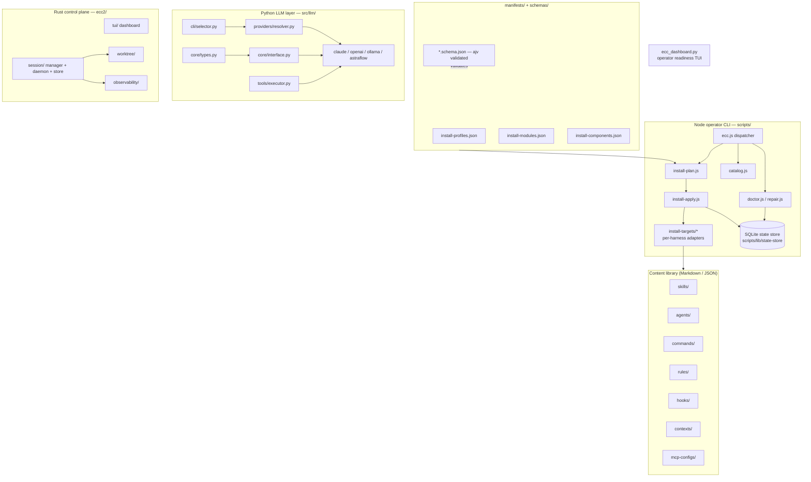

# Architecture — ECC (everything-claude-code)

> System overview, component map, data flow, and key architectural decisions for the
> `ecc-universal` package (a.k.a. ECC — the harness-native operator system for agentic work).

## 1. What this repository is

ECC is **not a single running application**. It is a *content-and-tooling distribution*:

1. A large curated library of **agent harness content** — skills, agents, commands,
   rules, hooks, MCP configs — authored as Markdown/JSON and shipped to many AI coding
   harnesses (Claude Code, Codex, Cursor, OpenCode, Gemini, Zed, Qwen, Kiro, …).
2. A **cross-platform Node.js installer + operator CLI** (`scripts/`) that plans and
   applies that content into each harness's expected on-disk layout, then tracks install
   state in a SQLite store.
3. A **provider-agnostic Python LLM abstraction** (`src/llm/`) used by tooling/examples.
4. An **alpha Rust control plane** (`ecc2/`) — a TUI + daemon for managing many agent
   sessions from one surface.
5. A **Python TUI dashboard** (`ecc_dashboard.py`) for operator-readiness reporting.

The bulk of the repo by file count (2,000+ Markdown files) is content; the "code" is the
installer, the LLM layer, the Rust control plane, and the CI/validation scripts.

## 2. Component map

## 3. Data flow

### Install flow (the primary user path)
1. User runs `npx ecc <profile-or-component>` (or `install.sh` / `install.ps1`).
2. `scripts/ecc.js` dispatches to `install-apply.js`.
3. The installer resolves a **profile → modules → components** plan from `manifests/`
   (validated against `schemas/install-*.schema.json` via `ajv`).
4. A **target adapter** (`scripts/lib/install-targets/<harness>.js`) maps each component
   to that harness's on-disk convention (e.g. `~/.claude/skills/…`, `.cursor/rules/…`).
5. Files are copied/merged; an **install-state** record is written to the SQLite state
   store (`scripts/lib/state-store/`) for later `doctor`/`repair`/`list-installed`.

### LLM call flow (`src/llm/`)
`Message[]` → `LLMInput` → `get_provider()` resolves a `ProviderType` (arg → `LLM_PROVIDER`
env → `.llm.env` → default `claude`) → concrete `LLMProvider.generate()` → `LLMOutput`
(optionally with `ToolCall`s, executed via `ToolExecutor`).

### Session flow (`ecc2/`)
TUI/CLI starts a session → `session/manager.rs` persists to SQLite (`session/store.rs`),
optionally detaches as a `daemon.rs` background process, surfaces output + risk score in
the `tui/dashboard.rs`.

## 4. External dependencies & blast radius

| Dependency | Used by | If it goes down |
|---|---|---|
| Node.js >= 18 | entire installer/CLI, CI validators | installer + `npm test` unusable; content still readable |
| `ajv` | manifest/schema validation | install planning fails closed (refuses bad manifests) |
| `sql.js` | Node state store | install-state tracking degrades; install can still apply |
| `@iarna/toml` | Codex/TOML config merge | Codex config merge fails; other harnesses unaffected |
| Python >= 3.11 | `src/llm/`, dashboard, AURA adapter | LLM layer + dashboard unusable; installer unaffected |
| `anthropic` / `openai` SDKs | `src/llm/providers/` | only the affected provider fails; resolver can pick another |
| Rust toolchain | `ecc2/` build | control plane can't build; rest of repo unaffected |
| Target harness install dirs (`~/.claude`, `.cursor`, …) | install-targets | that harness install no-ops; others proceed |

Blast radius is intentionally **partitioned**: the four code surfaces (Node CLI, Python
LLM, Rust control plane, Python dashboard) are independent and degrade independently.

## 5. Concurrency model

- **Node installer:** synchronous/sequential per invocation; `orchestrate-worktrees.js`
  fans work across git worktrees + tmux for parallel multi-session runs.
- **Python LLM layer:** synchronous `generate()`; tests use `pytest-asyncio` (`asyncio_mode = auto`).
- **Rust control plane (`ecc2/`):** `tokio` async runtime; multiple sessions tracked
  concurrently; daemon mode detaches sessions. SQLite access guarded; tests serialize
  current-dir mutation with a process-wide `Mutex` (see `main.rs::test_support`).

## 6. Caching strategy

- **Harness cost cache:** the cost/observability hooks cache per-harness cost data and
  prefer the freshest cache (`scripts/lib/cost-estimate.js`, see PR #2054).
- **SQLite state store:** durable install-state cache enabling drift detection
  (`doctor`/`repair`) without re-scanning the filesystem.
- **Content hashing:** components carry provenance/hashes (`schemas/provenance.schema.json`)
  so `doctor` can detect drift. There is no in-memory request cache in the LLM layer.

## 7. Key architectural decisions

1. **Content-as-data, installer-as-code.** Skills/agents/rules are Markdown so they are
   reviewable, diffable, and harness-portable; only the installer and validators are
   executable. Rationale: a single source library can target 7+ harnesses.
2. **Per-harness target adapters + a manifest/schema layer.** Adding a harness is adding
   one `install-targets/*.js` module; what to install is declared in `manifests/` and
   validated by `schemas/`. Rationale: open/closed — extend by adding, not editing core.
3. **SQLite state store for install provenance.** Enables `doctor`/`repair`/`status`
   drift detection and uninstall. Rationale: installs are stateful and must be reversible.
4. **Provider-agnostic LLM interface with a resolver.** `LLMProvider` ABC + `get_provider`
   factory + env/file resolution. Rationale: swap models without touching call sites.
5. **`ecc2/` as a separate alpha crate, not wired into the npm package.** Rationale: the
   control plane is GA-track but isolated so alpha churn never breaks the stable installer.

## 8. Known limitations

- `ecc2/` is **alpha**: not part of the npm distribution, API unstable, Claude-Code-first.
- The repo is content-heavy; CI validators (`scripts/ci/validate-*.js`) are the real gate
  on content correctness — a malformed skill/agent fails `npm test`, not at runtime.
- The Python LLM layer is `0.1.0` alpha; `astraflow` provider targets a specific gateway.
- No single "run the app" entry point — there are four independent surfaces.
- Localization docs (`docs/<locale>/`) can lag the English source between sync PRs.
